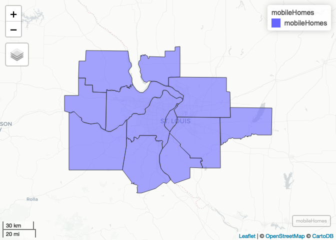
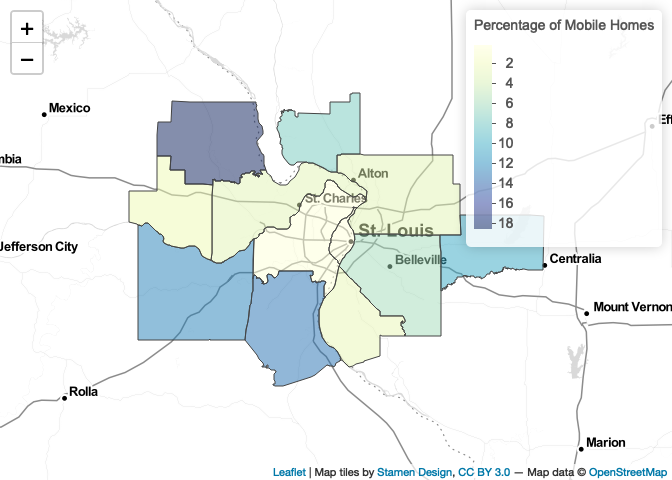
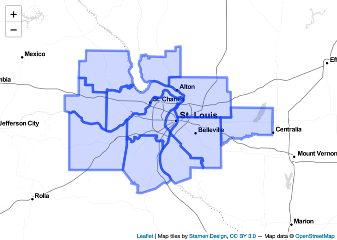
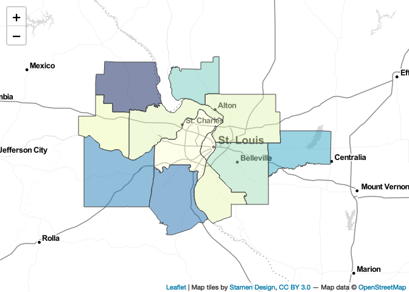

Lab-04 Replication
================
Branson Fox
(February 17, 2019)

## Introduction

This notebook replicates Lab-04 - Interactive Mapping of Structures at
Risk.

## Dependencies

This notebook requires the packages we used and discussed in lecture-05.

``` r
# spatial packages
library(leaflet)      # interactive maps
library(mapview)      # preview spatial data
library(sf)           # tools for spatial data
```

    ## Linking to GEOS 3.6.1, GDAL 2.1.3, PROJ 4.9.3

``` r
# other packages
library(here)         # file path management
```

    ## here() starts at /Users/chris/GitHub/SOC5650/LectureRepos/lecture-05/assignments/lab-04-replication

``` r
library(RColorBrewer) # color palettes
```

## Load Data

This notebook requires the data stored in `data/`. Remember that we use
`st_read()` to read shapefiles, and `here()` to specify where these
files are
located.

``` r
mobileHomes <- st_read(here("data", "METRO_STRUCTURE_PctMobileHome", "METRO_STRUCTURE_PctMobileHome.shp"), 
                       stringsAsFactors = FALSE)
```

    ## Reading layer `METRO_STRUCTURE_PctMobileHome' from data source `/Users/chris/GitHub/SOC5650/LectureRepos/lecture-05/assignments/lab-04-replication/data/METRO_STRUCTURE_PctMobileHome/METRO_STRUCTURE_PctMobileHome.shp' using driver `ESRI Shapefile'
    ## Simple feature collection with 12 features and 24 fields
    ## geometry type:  POLYGON
    ## dimension:      XY
    ## bbox:           xmin: 637438.5 ymin: 4208959 xmax: 836287.1 ymax: 4349723
    ## epsg (SRID):    26915
    ## proj4string:    +proj=utm +zone=15 +datum=NAD83 +units=m +no_defs

## Part 1: Data Exploration

### Question 1

We use the `str()` function to list the variables in our data.

``` r
str(mobileHomes)
```

    ## Classes 'sf' and 'data.frame':   12 obs. of  25 variables:
    ##  $ STATEFP   : chr  "29" "29" "29" "29" ...
    ##  $ COUNTYFP  : chr  "189" "071" "183" "510" ...
    ##  $ COUNTYNS  : chr  "00758549" "00758490" "00758546" "00767557" ...
    ##  $ AFFGEOID  : chr  "0500000US29189" "0500000US29071" "0500000US29183" "0500000US29510" ...
    ##  $ GEOID     : chr  "29189" "29071" "29183" "29510" ...
    ##  $ NAME      : chr  "St. Louis" "Franklin" "St. Charles" "St. Louis City" ...
    ##  $ LSAD      : chr  "06" "06" "06" "25" ...
    ##  $ ALAND     : num  1.32e+09 2.39e+09 1.45e+09 1.60e+08 1.70e+09 ...
    ##  $ AWATER    : num  39385817 20729139 83314211 10670040 42081592 ...
    ##  $ OBJECTID_1: num  1147 1141 1151 1145 510 ...
    ##  $ STATE     : chr  "MO" "MO" "MO" "MO" ...
    ##  $ CWA       : chr  "LSX" "LSX" "LSX" "LSX" ...
    ##  $ COUNTYNAME: chr  "St. Louis" "Franklin" "St. Charles" "St. Louis City" ...
    ##  $ FIPS      : int  29189 29071 29183 29510 17163 17119 17027 17187 17133 17083 ...
    ##  $ TIME_ZONE : chr  "C" "C" "C" "C" ...
    ##  $ FE_AREA   : chr  "ec" "ec" "ec" "ec" ...
    ##  $ LON       : num  -90.4 -91.1 -90.5 -90.2 -90 ...
    ##  $ LAT       : num  38.6 38.5 38.8 38.7 38.4 ...
    ##  $ MobileHome: num  0.4 12.5 3.3 0.2 6 3.3 10.3 2.5 2.9 7.5 ...
    ##  $ ErrorMargi: num  0.1 1.2 0.3 0.1 0.4 0.3 1.4 1.2 1.1 1.6 ...
    ##  $ Shape_Leng: num  207713 222926 240603 64486 177900 ...
    ##  $ Shape_Area: num  1.35e+09 2.39e+09 1.50e+09 1.80e+08 1.71e+09 ...
    ##  $ Shape_Le_1: num  2.252 2.279 2.642 0.652 1.896 ...
    ##  $ Shape_Ar_1: num  0.1403 0.2486 0.1591 0.0177 0.1802 ...
    ##  $ geometry  :sfc_POLYGON of length 12; first list element: List of 1
    ##   ..$ : num [1:453, 1:2] 697472 697478 697473 697481 697468 ...
    ##   ..- attr(*, "class")= chr  "XY" "POLYGON" "sfg"
    ##  - attr(*, "sf_column")= chr "geometry"
    ##  - attr(*, "agr")= Factor w/ 3 levels "constant","aggregate",..: NA NA NA NA NA NA NA NA NA NA ...
    ##   ..- attr(*, "names")= chr  "STATEFP" "COUNTYFP" "COUNTYNS" "AFFGEOID" ...

Some of these variables may seem confusing, but the more you work with
spatial data, they become intuitive. For example `STATEFP` is the state
FIPS code. Missouri is 29 and Illinois is 17. The important variable in
these data is `MobileHome` which estimates the percent of homes that are
mobile homes.

### Question 2

Now, we will create an interactive preview of the data using the
`mapview()` function.

``` r
mapView(mobileHomes)
```

<!-- -->

We now have an interactive preview of the data.

## Part 2: Interactive Mapping

### Question 3

Now, we will use leaflet to create an interactive map. But first, we
should use the following function to choose a basemap.

``` r
names(providers)
```

    ##   [1] "OpenStreetMap"                      
    ##   [2] "OpenStreetMap.Mapnik"               
    ##   [3] "OpenStreetMap.BlackAndWhite"        
    ##   [4] "OpenStreetMap.DE"                   
    ##   [5] "OpenStreetMap.CH"                   
    ##   [6] "OpenStreetMap.France"               
    ##   [7] "OpenStreetMap.HOT"                  
    ##   [8] "OpenStreetMap.BZH"                  
    ##   [9] "OpenInfraMap"                       
    ##  [10] "OpenInfraMap.Power"                 
    ##  [11] "OpenInfraMap.Telecom"               
    ##  [12] "OpenInfraMap.Petroleum"             
    ##  [13] "OpenInfraMap.Water"                 
    ##  [14] "OpenSeaMap"                         
    ##  [15] "OpenPtMap"                          
    ##  [16] "OpenTopoMap"                        
    ##  [17] "OpenRailwayMap"                     
    ##  [18] "OpenFireMap"                        
    ##  [19] "SafeCast"                           
    ##  [20] "Thunderforest"                      
    ##  [21] "Thunderforest.OpenCycleMap"         
    ##  [22] "Thunderforest.Transport"            
    ##  [23] "Thunderforest.TransportDark"        
    ##  [24] "Thunderforest.SpinalMap"            
    ##  [25] "Thunderforest.Landscape"            
    ##  [26] "Thunderforest.Outdoors"             
    ##  [27] "Thunderforest.Pioneer"              
    ##  [28] "OpenMapSurfer"                      
    ##  [29] "OpenMapSurfer.Roads"                
    ##  [30] "OpenMapSurfer.AdminBounds"          
    ##  [31] "OpenMapSurfer.Grayscale"            
    ##  [32] "Hydda"                              
    ##  [33] "Hydda.Full"                         
    ##  [34] "Hydda.Base"                         
    ##  [35] "Hydda.RoadsAndLabels"               
    ##  [36] "MapBox"                             
    ##  [37] "Stamen"                             
    ##  [38] "Stamen.Toner"                       
    ##  [39] "Stamen.TonerBackground"             
    ##  [40] "Stamen.TonerHybrid"                 
    ##  [41] "Stamen.TonerLines"                  
    ##  [42] "Stamen.TonerLabels"                 
    ##  [43] "Stamen.TonerLite"                   
    ##  [44] "Stamen.Watercolor"                  
    ##  [45] "Stamen.Terrain"                     
    ##  [46] "Stamen.TerrainBackground"           
    ##  [47] "Stamen.TopOSMRelief"                
    ##  [48] "Stamen.TopOSMFeatures"              
    ##  [49] "Esri"                               
    ##  [50] "Esri.WorldStreetMap"                
    ##  [51] "Esri.DeLorme"                       
    ##  [52] "Esri.WorldTopoMap"                  
    ##  [53] "Esri.WorldImagery"                  
    ##  [54] "Esri.WorldTerrain"                  
    ##  [55] "Esri.WorldShadedRelief"             
    ##  [56] "Esri.WorldPhysical"                 
    ##  [57] "Esri.OceanBasemap"                  
    ##  [58] "Esri.NatGeoWorldMap"                
    ##  [59] "Esri.WorldGrayCanvas"               
    ##  [60] "OpenWeatherMap"                     
    ##  [61] "OpenWeatherMap.Clouds"              
    ##  [62] "OpenWeatherMap.CloudsClassic"       
    ##  [63] "OpenWeatherMap.Precipitation"       
    ##  [64] "OpenWeatherMap.PrecipitationClassic"
    ##  [65] "OpenWeatherMap.Rain"                
    ##  [66] "OpenWeatherMap.RainClassic"         
    ##  [67] "OpenWeatherMap.Pressure"            
    ##  [68] "OpenWeatherMap.PressureContour"     
    ##  [69] "OpenWeatherMap.Wind"                
    ##  [70] "OpenWeatherMap.Temperature"         
    ##  [71] "OpenWeatherMap.Snow"                
    ##  [72] "HERE"                               
    ##  [73] "HERE.normalDay"                     
    ##  [74] "HERE.normalDayCustom"               
    ##  [75] "HERE.normalDayGrey"                 
    ##  [76] "HERE.normalDayMobile"               
    ##  [77] "HERE.normalDayGreyMobile"           
    ##  [78] "HERE.normalDayTransit"              
    ##  [79] "HERE.normalDayTransitMobile"        
    ##  [80] "HERE.normalNight"                   
    ##  [81] "HERE.normalNightMobile"             
    ##  [82] "HERE.normalNightGrey"               
    ##  [83] "HERE.normalNightGreyMobile"         
    ##  [84] "HERE.basicMap"                      
    ##  [85] "HERE.mapLabels"                     
    ##  [86] "HERE.trafficFlow"                   
    ##  [87] "HERE.carnavDayGrey"                 
    ##  [88] "HERE.hybridDay"                     
    ##  [89] "HERE.hybridDayMobile"               
    ##  [90] "HERE.pedestrianDay"                 
    ##  [91] "HERE.pedestrianNight"               
    ##  [92] "HERE.satelliteDay"                  
    ##  [93] "HERE.terrainDay"                    
    ##  [94] "HERE.terrainDayMobile"              
    ##  [95] "FreeMapSK"                          
    ##  [96] "MtbMap"                             
    ##  [97] "CartoDB"                            
    ##  [98] "CartoDB.Positron"                   
    ##  [99] "CartoDB.PositronNoLabels"           
    ## [100] "CartoDB.PositronOnlyLabels"         
    ## [101] "CartoDB.DarkMatter"                 
    ## [102] "CartoDB.DarkMatterNoLabels"         
    ## [103] "CartoDB.DarkMatterOnlyLabels"       
    ## [104] "HikeBike"                           
    ## [105] "HikeBike.HikeBike"                  
    ## [106] "HikeBike.HillShading"               
    ## [107] "BasemapAT"                          
    ## [108] "BasemapAT.basemap"                  
    ## [109] "BasemapAT.grau"                     
    ## [110] "BasemapAT.overlay"                  
    ## [111] "BasemapAT.highdpi"                  
    ## [112] "BasemapAT.orthofoto"                
    ## [113] "nlmaps"                             
    ## [114] "nlmaps.standaard"                   
    ## [115] "nlmaps.pastel"                      
    ## [116] "nlmaps.grijs"                       
    ## [117] "nlmaps.luchtfoto"                   
    ## [118] "NASAGIBS"                           
    ## [119] "NASAGIBS.ModisTerraTrueColorCR"     
    ## [120] "NASAGIBS.ModisTerraBands367CR"      
    ## [121] "NASAGIBS.ViirsEarthAtNight2012"     
    ## [122] "NASAGIBS.ModisTerraLSTDay"          
    ## [123] "NASAGIBS.ModisTerraSnowCover"       
    ## [124] "NASAGIBS.ModisTerraAOD"             
    ## [125] "NASAGIBS.ModisTerraChlorophyll"     
    ## [126] "NLS"                                
    ## [127] "JusticeMap"                         
    ## [128] "JusticeMap.income"                  
    ## [129] "JusticeMap.americanIndian"          
    ## [130] "JusticeMap.asian"                   
    ## [131] "JusticeMap.black"                   
    ## [132] "JusticeMap.hispanic"                
    ## [133] "JusticeMap.multi"                   
    ## [134] "JusticeMap.nonWhite"                
    ## [135] "JusticeMap.white"                   
    ## [136] "JusticeMap.plurality"               
    ## [137] "Wikimedia"

For the replication, I’ll use `Stamen.TonerLite`. If you would like to
preview the basemaps provided by leaflet, you can do so
[here](https://leaflet-extras.github.io/leaflet-providers/preview/).

### Question 4

Now, we will use leaflet to symbolize the percentage of mobile homes in
each county. We will discuss projections more in depth later, but for
now, we will just know that leaflet requires our data to be in
`WGS 1984`. To re-project our data, we use the `st_transform()`
function:

``` r
mobileHomes84 <- st_transform(mobileHomes, crs = 4326)
```

With our data are now re-projected, we’ll make our map:

``` r
# first, define a color ramp
ramp <- colorNumeric("YlGnBu", mobileHomes84$MobileHome)

# then, we will add it to our leaflet code
mobileHomes84 %>%
  leaflet() %>%
  addProviderTiles(providers$Stamen.TonerLite) %>%
  addPolygons(
    color = "#444444",
    weight = 1,
    opacity = 1.0,
    smoothFactor = 0.5,
    fillOpacity = 0.5,
    fillColor = ~ramp(MobileHome),
    highlightOptions = highlightOptions(color = "white", weight = 2, bringToFront = TRUE),
    popup = paste("<b>County:</b> ", mobileHomes84$NAME, "<br>", 
                  "<b>Percentage of Mobile Homes:</b> ", mobileHomes84$MobileHome)) %>%
  addLegend(pal = ramp, values = ~MobileHome, opacity = .5, title = "Percentage of Mobile Homes")
```

<!-- -->

## Appendix

If you were going to work through this iteratively, here are some
logical ways to start with a simple map and make it more complex. First,
create a simple interactive leaflet map:

``` r
mobileHomes84 %>%
  leaflet() %>%
  addProviderTiles(providers$Stamen.TonerLite) %>% 
  addPolygons()
```

<!-- -->

Now, we will add additional formatting to our leaflet code to symbolize
mobile homes:

``` r
# first, define a color ramp
ramp <- colorNumeric("YlGnBu", mobileHomes84$MobileHome)

# then, we will add it to our leaflet code
mobileHomes84 %>%
  leaflet() %>%
  addProviderTiles(providers$Stamen.TonerLite) %>%
  addPolygons(
    color = "#444444",
    weight = 1,
    opacity = 1.0,
    smoothFactor = 0.5,
    fillOpacity = 0.5,
    fillColor = ~ramp(MobileHome),
    highlightOptions = highlightOptions(color = "white", weight = 2, bringToFront = TRUE))
```

<!-- -->

Next, we will add popup labels:

``` r
# first, define a color ramp
ramp <- colorNumeric("YlGnBu", mobileHomes84$MobileHome)

# then, we will add it to our leaflet code
mobileHomes84 %>%
  leaflet() %>%
  addProviderTiles(providers$Stamen.TonerLite) %>%
  addPolygons(
    color = "#444444",
    weight = 1,
    opacity = 1.0,
    smoothFactor = 0.5,
    fillOpacity = 0.5,
    fillColor = ~ramp(MobileHome),
    highlightOptions = highlightOptions(color = "white", weight = 2, bringToFront = TRUE),
    popup = paste("<b>County:</b> ", mobileHomes84$NAME, "<br>", 
                  "<b>Percentage of Mobile Homes:</b> ", mobileHomes84$MobileHome))
```

<!-- -->

And finally we will add a legend to complete our interactive map:

``` r
# first, define a color ramp
ramp <- colorNumeric("YlGnBu", mobileHomes84$MobileHome)

# then, we will add it to our leaflet code
mobileHomes84 %>%
  leaflet() %>%
  addProviderTiles(providers$Stamen.TonerLite) %>%
  addPolygons(
    color = "#444444",
    weight = 1,
    opacity = 1.0,
    smoothFactor = 0.5,
    fillOpacity = 0.5,
    fillColor = ~ramp(MobileHome),
    highlightOptions = highlightOptions(color = "white", weight = 2, bringToFront = TRUE),
    popup = paste("<b>County:</b> ", mobileHomes84$NAME, "<br>", 
                  "<b>Percentage of Mobile Homes:</b> ", mobileHomes84$MobileHome)) %>%
  addLegend(pal = ramp, values = ~MobileHome, opacity = .5, title = "Percentage of Mobile Homes")
```

<!-- -->
