Lecture-05 Examples
================
Christopher Prener, Ph.D.
(February 11, 2019)

## Introduction

This notebook covers basic map production in `R` using a variety of
tools. We’ll review some of what we discussed during
[Lecture-01](https://slu-soc5650.github.io/docs/lecture-01/) and then
introduce two new approaches for mapping.

## Dependencies

This notebook requires a variety of packages for working with spatial
data:

``` r
# tidyverse packages
library(ggplot2)      # plotting data

# spatial packages
library(leaflet)      # interactive maps
library(mapview)      # preview spatial data
library(tmap)         # map layouts
library(sf)           # spatial data tools
```

    ## Linking to GEOS 3.6.1, GDAL 2.1.3, PROJ 4.9.3

``` r
# other packages
library(here)         # file path management
```

    ## here() starts at /Users/chris/GitHub/SOC5650/LectureRepos/lecture-05

``` r
library(RColorBrewer) # color palettes
library(viridis)      # color palettes
```

    ## Loading required package: viridisLite

For best results, you should also have PhantomJS installed as well:

``` r
webshot::install_phantomjs()
```

## Load Data (Lecture-01 Review)

This notebook requires the data stored in `data/example-data/`. Remember
that we use `sf::st_read()` to load shapefile
data:

``` r
city <- st_read(here("data", "example-data", "STL_BOUNDARY_City", "STL_BOUNDARY_City.shp"), stringsAsFactors = FALSE)
```

    ## Reading layer `STL_BOUNDARY_City' from data source `/Users/chris/GitHub/SOC5650/LectureRepos/lecture-05/data/example-data/STL_BOUNDARY_City/STL_BOUNDARY_City.shp' using driver `ESRI Shapefile'
    ## Simple feature collection with 1 feature and 17 fields
    ## geometry type:  POLYGON
    ## dimension:      XY
    ## bbox:           xmin: -90.32052 ymin: 38.53185 xmax: -90.16657 ymax: 38.77443
    ## epsg (SRID):    NA
    ## proj4string:    +proj=longlat +ellps=GRS80 +no_defs

``` r
nhoods <- st_read(here("data", "example-data", "STL_DEMOS_Nhoods", "STL_DEMOS_Nhoods.shp"), stringsAsFactors = FALSE)
```

    ## Reading layer `STL_DEMOS_Nhoods' from data source `/Users/chris/GitHub/SOC5650/LectureRepos/lecture-05/data/example-data/STL_DEMOS_Nhoods/STL_DEMOS_Nhoods.shp' using driver `ESRI Shapefile'
    ## Simple feature collection with 79 features and 6 fields
    ## geometry type:  MULTIPOLYGON
    ## dimension:      XY
    ## bbox:           xmin: 733361.8 ymin: 4268512 xmax: 745417.9 ymax: 4295501
    ## epsg (SRID):    NA
    ## proj4string:    +proj=utm +zone=15 +ellps=GRS80 +units=m +no_defs

## Projections

We haven’t talked about projections, yet. They are a part of how we
render geometric data on two-dimensional maps. ArcGIS Pro is a bit more
flexible than `R` packages are when it comes to projections For now, the
more important thing to know is that we need to adjust the projection
being used for our data. We’ll use two projections today:

  - WGS 1984 (crs = `4326`)
  - UTM 15N (crs = `32615`)

To ensure that our data are projected correctly, we use
`sf::st_transform()`:

``` r
# city boundary
city <- st_transform(city, crs = 32615)
city84 <- st_transform(city, crs = 4326)

# neighborhood demographics
nhoods <- st_transform(nhoods, crs = 32615)
nhoods84 <- st_transform(nhoods, crs = 4326)
```

## Exploring Data

There are two ways we can explore our data - we can inspect them using
functions that print particular properties of each object, and we can
inspect them visually.

### Listing Properties

The `utils::str()` function gives us a chance to preivew the data in
terms of variable names and the a quick snapshot of the data each
variable contains. We can do this for the `city` data:

``` r
str(city)
```

    ## Classes 'sf' and 'data.frame':   1 obs. of  18 variables:
    ##  $ STATEFP : chr "29"
    ##  $ COUNTYFP: chr "510"
    ##  $ COUNTYNS: chr "00767557"
    ##  $ GEOID   : chr "29510"
    ##  $ NAME    : chr "St. Louis"
    ##  $ NAMELSAD: chr "St. Louis city"
    ##  $ LSAD    : chr "25"
    ##  $ CLASSFP : chr "C7"
    ##  $ MTFCC   : chr "G4020"
    ##  $ CSAFP   : chr "476"
    ##  $ CBSAFP  : chr "41180"
    ##  $ METDIVFP: chr NA
    ##  $ FUNCSTAT: chr "F"
    ##  $ ALAND   : chr "160458044"
    ##  $ AWATER  : chr "10670040"
    ##  $ INTPTLAT: chr "+38.6356988"
    ##  $ INTPTLON: chr "-090.2445816"
    ##  $ geometry:sfc_POLYGON of length 1; first list element: List of 1
    ##   ..$ : num [1:660, 1:2] 733360 733361 733429 733433 733447 ...
    ##   ..- attr(*, "class")= chr  "XY" "POLYGON" "sfg"
    ##  - attr(*, "sf_column")= chr "geometry"
    ##  - attr(*, "agr")= Factor w/ 3 levels "constant","aggregate",..: NA NA NA NA NA NA NA NA NA NA ...
    ##   ..- attr(*, "names")= chr  "STATEFP" "COUNTYFP" "COUNTYNS" "GEOID" ...

We can also do this for the `nhoods` data:

``` r
str(nhoods)
```

    ## Classes 'sf' and 'data.frame':   79 obs. of  7 variables:
    ##  $ NHD_NUM  : num  43 29 28 40 41 42 39 44 36 37 ...
    ##  $ NHD_NAME : chr  "Franz Park" "Tiffany" "Botanical Heights" "Kings Oak" ...
    ##  $ pop50    : num  3303 4418 5869 388 2278 ...
    ##  $ pop17    : num  1306 963 1680 449 881 ...
    ##  $ popChange: num  -60.4 -78.2 -71.4 15.7 -61.3 ...
    ##  $ AREA     : num  1023752 547360 1077170 437583 859566 ...
    ##  $ geometry :sfc_MULTIPOLYGON of length 79; first list element: List of 1
    ##   ..$ :List of 1
    ##   .. ..$ : num [1:46, 1:2] 735143 735184 735189 735249 735254 ...
    ##   ..- attr(*, "class")= chr  "XY" "MULTIPOLYGON" "sfg"
    ##  - attr(*, "sf_column")= chr "geometry"
    ##  - attr(*, "agr")= Factor w/ 3 levels "constant","aggregate",..: NA NA NA NA NA NA
    ##   ..- attr(*, "names")= chr  "NHD_NUM" "NHD_NAME" "pop50" "pop17" ...

### Visually Inspecting Objects

We can also visually inspect the tabular data by clicking on objects in
the Enviornment tab or, alternatively, using `View()` in the console -
`View(city)`. To get a preview of the spatial data, we can use the
`mapview` package’s `mapview()` function. Once the map is created, we
can alter the basemap by clicking the icon under the zoom in and out
buttons. We can preview the tabular data for each feature by clicking on
it:

``` r
mapview(city)
```

<!-- -->

Here is the preview for the `nhoods` data:

``` r
mapview(nhoods)
```

<!-- -->

Getting a sense of how the data are structured, both in terms of their
tabular attributes and geometric properties, is the first thing you
should do when you bring data into `R`.

## Interactive Mapping with `leaflet` (Lecture-01 Review)

### Basic Mapping of Geometric Objects

During Lecture-01, we discussed the creation of interactive maps using
the `leaflet` package. [Leaflet](https://leafletjs.com) is a JavaScript
library for creating interactive maps. It is primarily focused on web
and mobile mapping. The `leaflet` package for `R` provides access to the
JavaScript library.

Leaflet provides a number of basemaps for mapping. If you add map tiles
using `addTiles()`, you’ll get the open street map basemap. Other
basemaps can be added using `addProviderTiles()`. The names of available
options can be found using:

``` r
names(providers)
```

    ##   [1] "OpenStreetMap"                      
    ##   [2] "OpenStreetMap.Mapnik"               
    ##   [3] "OpenStreetMap.BlackAndWhite"        
    ##   [4] "OpenStreetMap.DE"                   
    ##   [5] "OpenStreetMap.CH"                   
    ##   [6] "OpenStreetMap.France"               
    ##   [7] "OpenStreetMap.HOT"                  
    ##   [8] "OpenStreetMap.BZH"                  
    ##   [9] "OpenInfraMap"                       
    ##  [10] "OpenInfraMap.Power"                 
    ##  [11] "OpenInfraMap.Telecom"               
    ##  [12] "OpenInfraMap.Petroleum"             
    ##  [13] "OpenInfraMap.Water"                 
    ##  [14] "OpenSeaMap"                         
    ##  [15] "OpenPtMap"                          
    ##  [16] "OpenTopoMap"                        
    ##  [17] "OpenRailwayMap"                     
    ##  [18] "OpenFireMap"                        
    ##  [19] "SafeCast"                           
    ##  [20] "Thunderforest"                      
    ##  [21] "Thunderforest.OpenCycleMap"         
    ##  [22] "Thunderforest.Transport"            
    ##  [23] "Thunderforest.TransportDark"        
    ##  [24] "Thunderforest.SpinalMap"            
    ##  [25] "Thunderforest.Landscape"            
    ##  [26] "Thunderforest.Outdoors"             
    ##  [27] "Thunderforest.Pioneer"              
    ##  [28] "OpenMapSurfer"                      
    ##  [29] "OpenMapSurfer.Roads"                
    ##  [30] "OpenMapSurfer.AdminBounds"          
    ##  [31] "OpenMapSurfer.Grayscale"            
    ##  [32] "Hydda"                              
    ##  [33] "Hydda.Full"                         
    ##  [34] "Hydda.Base"                         
    ##  [35] "Hydda.RoadsAndLabels"               
    ##  [36] "MapBox"                             
    ##  [37] "Stamen"                             
    ##  [38] "Stamen.Toner"                       
    ##  [39] "Stamen.TonerBackground"             
    ##  [40] "Stamen.TonerHybrid"                 
    ##  [41] "Stamen.TonerLines"                  
    ##  [42] "Stamen.TonerLabels"                 
    ##  [43] "Stamen.TonerLite"                   
    ##  [44] "Stamen.Watercolor"                  
    ##  [45] "Stamen.Terrain"                     
    ##  [46] "Stamen.TerrainBackground"           
    ##  [47] "Stamen.TopOSMRelief"                
    ##  [48] "Stamen.TopOSMFeatures"              
    ##  [49] "Esri"                               
    ##  [50] "Esri.WorldStreetMap"                
    ##  [51] "Esri.DeLorme"                       
    ##  [52] "Esri.WorldTopoMap"                  
    ##  [53] "Esri.WorldImagery"                  
    ##  [54] "Esri.WorldTerrain"                  
    ##  [55] "Esri.WorldShadedRelief"             
    ##  [56] "Esri.WorldPhysical"                 
    ##  [57] "Esri.OceanBasemap"                  
    ##  [58] "Esri.NatGeoWorldMap"                
    ##  [59] "Esri.WorldGrayCanvas"               
    ##  [60] "OpenWeatherMap"                     
    ##  [61] "OpenWeatherMap.Clouds"              
    ##  [62] "OpenWeatherMap.CloudsClassic"       
    ##  [63] "OpenWeatherMap.Precipitation"       
    ##  [64] "OpenWeatherMap.PrecipitationClassic"
    ##  [65] "OpenWeatherMap.Rain"                
    ##  [66] "OpenWeatherMap.RainClassic"         
    ##  [67] "OpenWeatherMap.Pressure"            
    ##  [68] "OpenWeatherMap.PressureContour"     
    ##  [69] "OpenWeatherMap.Wind"                
    ##  [70] "OpenWeatherMap.Temperature"         
    ##  [71] "OpenWeatherMap.Snow"                
    ##  [72] "HERE"                               
    ##  [73] "HERE.normalDay"                     
    ##  [74] "HERE.normalDayCustom"               
    ##  [75] "HERE.normalDayGrey"                 
    ##  [76] "HERE.normalDayMobile"               
    ##  [77] "HERE.normalDayGreyMobile"           
    ##  [78] "HERE.normalDayTransit"              
    ##  [79] "HERE.normalDayTransitMobile"        
    ##  [80] "HERE.normalNight"                   
    ##  [81] "HERE.normalNightMobile"             
    ##  [82] "HERE.normalNightGrey"               
    ##  [83] "HERE.normalNightGreyMobile"         
    ##  [84] "HERE.basicMap"                      
    ##  [85] "HERE.mapLabels"                     
    ##  [86] "HERE.trafficFlow"                   
    ##  [87] "HERE.carnavDayGrey"                 
    ##  [88] "HERE.hybridDay"                     
    ##  [89] "HERE.hybridDayMobile"               
    ##  [90] "HERE.pedestrianDay"                 
    ##  [91] "HERE.pedestrianNight"               
    ##  [92] "HERE.satelliteDay"                  
    ##  [93] "HERE.terrainDay"                    
    ##  [94] "HERE.terrainDayMobile"              
    ##  [95] "FreeMapSK"                          
    ##  [96] "MtbMap"                             
    ##  [97] "CartoDB"                            
    ##  [98] "CartoDB.Positron"                   
    ##  [99] "CartoDB.PositronNoLabels"           
    ## [100] "CartoDB.PositronOnlyLabels"         
    ## [101] "CartoDB.DarkMatter"                 
    ## [102] "CartoDB.DarkMatterNoLabels"         
    ## [103] "CartoDB.DarkMatterOnlyLabels"       
    ## [104] "HikeBike"                           
    ## [105] "HikeBike.HikeBike"                  
    ## [106] "HikeBike.HillShading"               
    ## [107] "BasemapAT"                          
    ## [108] "BasemapAT.basemap"                  
    ## [109] "BasemapAT.grau"                     
    ## [110] "BasemapAT.overlay"                  
    ## [111] "BasemapAT.highdpi"                  
    ## [112] "BasemapAT.orthofoto"                
    ## [113] "nlmaps"                             
    ## [114] "nlmaps.standaard"                   
    ## [115] "nlmaps.pastel"                      
    ## [116] "nlmaps.grijs"                       
    ## [117] "nlmaps.luchtfoto"                   
    ## [118] "NASAGIBS"                           
    ## [119] "NASAGIBS.ModisTerraTrueColorCR"     
    ## [120] "NASAGIBS.ModisTerraBands367CR"      
    ## [121] "NASAGIBS.ViirsEarthAtNight2012"     
    ## [122] "NASAGIBS.ModisTerraLSTDay"          
    ## [123] "NASAGIBS.ModisTerraSnowCover"       
    ## [124] "NASAGIBS.ModisTerraAOD"             
    ## [125] "NASAGIBS.ModisTerraChlorophyll"     
    ## [126] "NLS"                                
    ## [127] "JusticeMap"                         
    ## [128] "JusticeMap.income"                  
    ## [129] "JusticeMap.americanIndian"          
    ## [130] "JusticeMap.asian"                   
    ## [131] "JusticeMap.black"                   
    ## [132] "JusticeMap.hispanic"                
    ## [133] "JusticeMap.multi"                   
    ## [134] "JusticeMap.nonWhite"                
    ## [135] "JusticeMap.white"                   
    ## [136] "JusticeMap.plurality"               
    ## [137] "Wikimedia"

As you can see, there are a ton of choices\! We’ll use
`CartoDB.Positron` here, but feel free to pick one that you like for
assignments if we don’t specify what you should use. Make sure that your
other cartographic selections, such as color, do not clash with your
basemap.

The basic `leaflet` workflow involves piping functions together (the
`%>%` operator). Each time to see the pipe, think of the word “then.”
For example, the following code chunk would read:

1.Take the `city84` object, **then** 2. use it as the basis for creating
a `leaflet` object with `leaflet()`, **then** 3. add a basemap using the
`CartoDB.Positron` tiles, **then** 4. add polygons and create a popup.

``` r
city84 %>%
  leaflet() %>%
  addProviderTiles(providers$CartoDB.Positron) %>%
  addPolygons(popup = ~NAME)
```

<!-- -->

We can get more into the weeds with the neighborhood data since they
have additional features. We can create more detailed popups using the
`base::paste()` function and some html tags. The most important html
tags to know are:

  - `<b>text</b>` - bold text
  - `<em>text</em>` - italicized text
  - `<br>` - line break

<!-- end list -->

``` r
nhoods84 %>%  
  leaflet() %>%
  addProviderTiles(providers$CartoDB.Positron) %>%
  addPolygons(popup = paste("<b>Name:</b> ", nhoods84$NHD_NAME, "<br>",
                            "<b>2017 Population:</b> ", round(nhoods84$pop17, digits = 0)))
```

<!-- -->

### Mapping Quantities with `leaflet`

If we want to turn this into a themeatic choropleth map, we can add some
additional parameters to the `addPolygons()` function. The options
included here are:

  - `color` - outline (“stroke”) color for each polygon
  - `weight` - stroke width
  - `opacity` - stroke opacity
  - `smoothFactor` - allows `leaflet` to simplify polygons depending on
    zoom
  - `fillOpacity` - fill opacity
  - `fillColor` - creates the fill itself
  - `highlightOptions` - creates effect when mouse drags over specific
    polygons

What I have here are good default settings for most of these options,
but feel free to experiment\!

When we created our popup, we want to round our values so that we don’t
see the very long real number associated with our data. By using
`base::round(var, digits = 0)`, we round to the nearest integer. `digits
= 2` would give us two decimal places in contrast.

``` r
# create color palette
npal <- colorNumeric("YlOrRd", nhoods84$pop17)

# create leaflet object
nhoods84 %>%
  leaflet() %>%
  addProviderTiles(providers$CartoDB.Positron) %>%
  addPolygons(
    color = "#444444", 
    weight = 1, 
    opacity = 1.0, 
    smoothFactor = 0.5,
    fillOpacity = 0.5,
    fillColor = ~npal(pop17),
    highlightOptions = highlightOptions(color = "white", weight = 2, bringToFront = TRUE),
    popup = paste("<b>Name:</b> ", nhoods84$NHD_NAME, "<br>",
                  "<b>2017 Population:</b> ", round(nhoods84$pop17, digits = 0))) 
```

<!-- -->

Next, we should add a legend to make the map easier to interpret. This
is done with the `addLegend()` argument. The `opacity` argument in
`addLegend()` should match the `fillOpacity` argument in
`addPolygons()`\!

``` r
# create color palette
npal <- colorNumeric("YlOrRd", nhoods84$pop17)

# create map
nhoods84 %>%
  leaflet() %>%
  addProviderTiles(providers$CartoDB.Positron) %>%
  addPolygons(
    color = "#444444", 
    weight = 1, 
    opacity = 1.0, 
    smoothFactor = 0.5,
    fillOpacity = 0.5,
    fillColor = ~npal(pop17),
    highlightOptions = highlightOptions(color = "white", weight = 2, bringToFront = TRUE),
    popup = paste("<b>Name:</b> ", nhoods84$NHD_NAME, "<br>",
                  "<b>2017 Population:</b> ", round(nhoods84$pop17, digits = 0))) %>%
    addLegend(pal = npal, values = ~pop17, opacity = .5, title = "Population (2017)")
```

<!-- -->

The colors come from the `RColorBrewer` package. We can use
`RColorBrewer::display.brewer.all()` to identify other color ramps:

``` r
display.brewer.all(type = "seq")
```

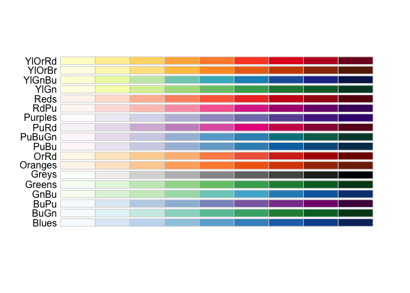<!-- -->

We’ll try the `YlGnBu` palette on this next map, which normalizes the
data but dividing our `AREA` variable (which is the area of each
neighborhood in square meters) by `1000000`to convert to square
kilometers. We use the `/` mathmatical operator to divide our values,
and paraentheses to ensure order of operations is respected. We add a
corresponding value to our popup as well:

``` r
# create color palette
npal <- colorNumeric("YlGnBu", nhoods84$pop17/(nhoods84$AREA/1000000))

# create map
nhoods84 %>%
  leaflet() %>%
  addProviderTiles(providers$CartoDB.Positron) %>%
  addPolygons(
    color = "#444444", 
    weight = 1, 
    opacity = 1.0, 
    smoothFactor = 0.5,
    fillOpacity = 0.5,
    fillColor = ~npal(pop17/(AREA/1000000)),
    highlightOptions = highlightOptions(color = "white", weight = 2, bringToFront = TRUE),
    popup = paste("<b>Name:</b> ", nhoods84$NHD_NAME, "<br>",
                  "<b>2017 Population:</b> ", round(nhoods84$pop17, digits = 0), "<br>",
                  "<b>2017 Population per Square Kilometer:</b> ", 
                      round((nhoods84$pop17/(nhoods84$AREA/1000000)), digits = 0))) %>%
    addLegend(pal = npal, values = ~pop17/(AREA/1000000), opacity = .5, 
              title = "Population Density (2017)")
```

<!-- -->

For our final `leaflet` map, we’ll change the color ramp again and
update the map to focus on 1950 instead of 2017:

``` r
# create color palette
npal <- colorNumeric("OrRd", nhoods84$pop50/(nhoods84$AREA/1000000))

# create map
nhoods84 %>%
  leaflet() %>%
  addProviderTiles(providers$CartoDB.Positron) %>%
  addPolygons(
    color = "#444444", 
    weight = 1, 
    smoothFactor = 0.5,
    opacity = 1.0, 
    fillOpacity = 0.5,
    fillColor = ~npal(pop50/(AREA/1000000)),
    highlightOptions = highlightOptions(color = "white", weight = 2, bringToFront = TRUE),
    popup = paste("<b>Name:</b> ", nhoods84$NHD_NAME, "<br>",
                  "<b>1950 Population:</b> ", round(nhoods84$pop50, digits = 0), "<br>",
                  "<b>1950 Population per Square Kilometer:</b> ", 
                      round((nhoods84$pop50/(nhoods84$AREA/1000000)), digits = 0))) %>%
    addLegend(pal = npal, values = ~pop50/(AREA/1000000), opacity = .5, 
              title = "Population Density (1950)")
```

<!-- -->

## Managing Our Enviornment

With GIS work, our enviornment gets cluttered. As I work on an analysis,
I find it useful to remove objects once I know that I am done with them.
We use the `base::rm()` function to do this:

``` r
rm(city84, nhoods84, npal)
```

## Simple Maps with `ggplot2`

### Basic Mapping of Geometric Objects

`ggplot2` is the premier graphics package for `R`. It is an incredibly
powerful visualization tool that increasingly supports spatial work and
mapping. The basic `ggplot2` workflow requires chaining together
functions with the `+` sign.

We’ll start by creating a `ggplot2` object with the `ggplot()` function,
and then adding a “geom”, which provides `ggplot2` instructions on how
our data should be visualized. We can read these like paragraphs:

1.  First, we create an empty `ggplot2` object, **then**
2.  we add the `nhoods` data and visualize its geometry.

<!-- end list -->

``` r
ggplot() +
  geom_sf(data = nhoods, fill = "#bababa")
```

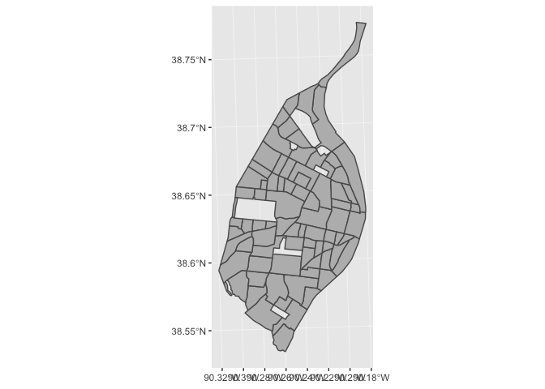<!-- -->

You can see empty spaces where there are major parks - if we wanted to
give these a background color, we could add the `city` layer under our
`nhoods` layer. We can also add the `city` layer again on top to give
the city border a pronouced outline. `ggplot2` relies on layering
different geoms to produce complicated plots. We can assign each geom a
specific set of aesthetic characteristics and use data from different
objects.

``` r
ggplot() +
  geom_sf(data = city, fill = "#ffffff", color = NA) +
  geom_sf(data = nhoods, fill = "#bababa") +
  geom_sf(data = city, fill = NA, color = "#000000", size = .75)
```

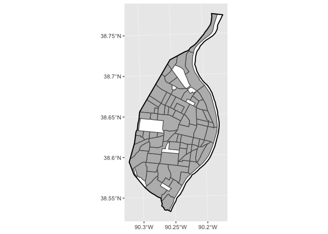<!-- -->

### Mapping Quantities with `ggplot2`

If we wanted to start to map data instead of just the geometric
properties, we would specify an “aesthetic mapping” using `mapping=
aes()` in the geom of interest. Here, we create a fill that is the
product of taking the population in 2017 and normalizing it by square
kilometers as we did in the `leaflet` section above. We provide
additional instructions about how our data should be colored with the
`scale_fill_distiller()` function, which gives us access to the
`RColorBrewer` palettes.

``` r
# create ggplot object
ggplot() +
  geom_sf(data = city, fill = "#ffffff", color = NA) +
  geom_sf(data = nhoods, mapping = aes(fill = pop17/(AREA/1000000))) +
  geom_sf(data = city, fill = NA, color = "#000000", size = .75) +
  scale_fill_distiller(palette = "Greens", trans = "reverse") -> ggplot_17_1

# print object
ggplot_17_1
```

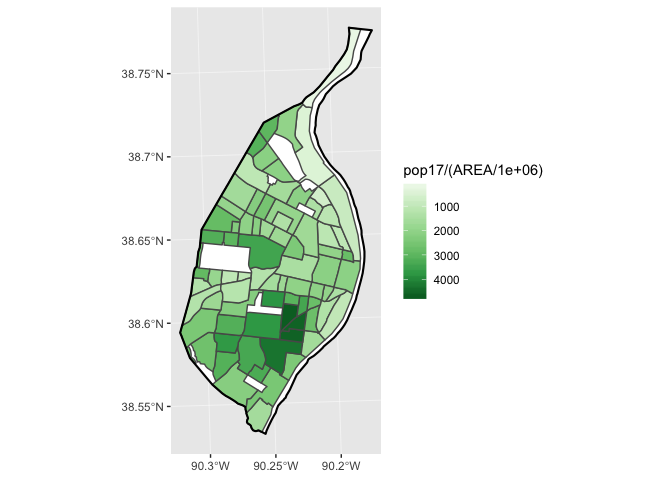<!-- -->

This map also stores our `ggplot` object in its own space in our global
enviornment. This allows us the ability to update it later, and to more
easily save it.

### Creating Map Layouts with `ggplot2`

Before we save it, however, we should create a more substantial layout.
We’ll use the `name` argument in `scale_fill_distiller()` to name the
legend, the `labs()` function to add text to our layout, and
`theme_minimal()` to remove some of the default `ggplot2` theme
elements:

``` r
# create ggplot object
ggplot() +
  geom_sf(data = city, fill = "#ededed", color = NA) +
  geom_sf(data = nhoods, mapping = aes(fill = pop17/(AREA/1000000))) +
  geom_sf(data = city, fill = NA, color = "#000000", size = .75) +
  scale_fill_distiller(palette = "Greens", trans = "reverse", name = "Population per\nSquare Kilometer") +
  labs(
    title = "Population Density (2017)",
    subtitle = "Neighborhoods in St. Louis, MO",
    caption = "Map by Christopher Prener, Ph.D."
  ) +
  theme_minimal() -> ggplot_17_2

# print object
ggplot_17_2
```

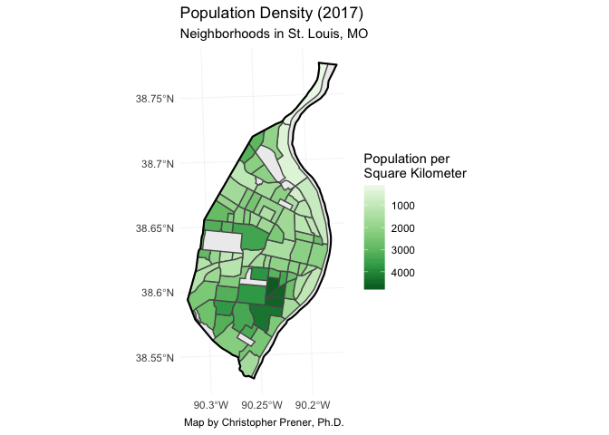<!-- -->

Next, to save our map, we use the `ggsave()`
function:

``` r
ggsave(here("examples", "results", "ggplot2_popDensity17.png"), ggplot_17_2, dpi = 500)
```

    ## Saving 7 x 5 in image

We can repeat this process for the 1950 data:

``` r
# create ggplot object
ggplot() +
  geom_sf(data = city, fill = "#ededed", color = NA) +
  geom_sf(data = nhoods, mapping = aes(fill = pop50/(AREA/1000000))) +
  geom_sf(data = city, fill = NA, color = "#000000", size = .75) +
  scale_fill_distiller(palette = "Blues", trans = "reverse", name = "Population per\nSquare Kilometer") +
  labs(
    title = "Population Density (1950)",
    subtitle = "Neighborhoods in St. Louis, MO",
    caption = "Map by Christopher Prener, Ph.D."
  ) +
  theme_minimal() -> ggplot_17_3

# print object
ggplot_17_3
```

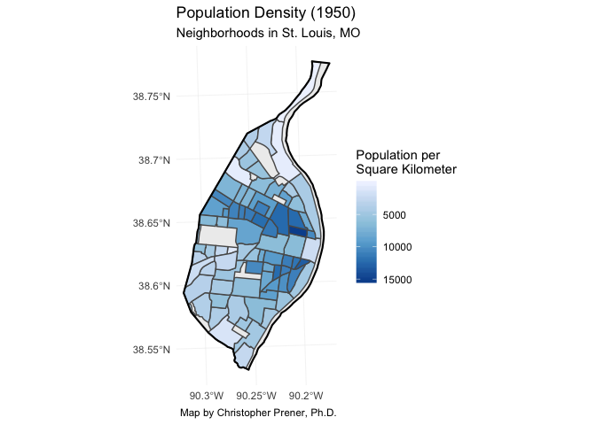<!-- -->

To save our map, we again use the `ggsave()`
function:

``` r
ggsave(here("examples", "results", "ggplot2_popDensity50.png"), ggplot_17_3, dpi = 500)
```

    ## Saving 7 x 5 in image

### Using `viridis` with `ggplot2`

The other option for color palettes is the `viridis` family of palettes.
These are specified by replacing `scale_fill_distiller()` with
`scale_fill_viridis()`. The `option` argument replaces `palette`, but
`name` has the same functionality:

``` r
# create ggplot object
ggplot() +
  geom_sf(data = city, fill = "#ededed", color = NA) +
  geom_sf(data = nhoods, mapping = aes(fill = pop17/(AREA/1000000))) +
  geom_sf(data = city, fill = NA, color = "#000000", size = .75) +
  scale_fill_viridis(option = "cividis", name = "Population per\nSquare Kilometer") +
  labs(
    title = "Population Density (2017)",
    subtitle = "Neighborhoods in St. Louis, MO",
    caption = "Map by Christopher Prener, Ph.D."
  ) +
  theme_minimal() -> ggplot_17_4

# print object
ggplot_17_4
```

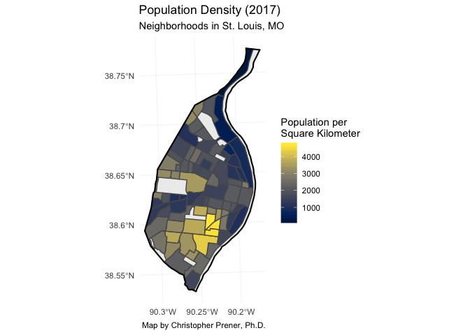<!-- -->

The other options for `viridis` are `viridis`, `magma`, `plasma`, and
`inferno`:

``` r
# create ggplot object
ggplot() +
  geom_sf(data = city, fill = "#ededed", color = NA) +
  geom_sf(data = nhoods, mapping = aes(fill = pop17/(AREA/1000000))) +
  geom_sf(data = city, fill = NA, color = "#000000", size = .75) +
  scale_fill_viridis(option = "viridis", name = "Population per\nSquare Kilometer") +
  labs(
    title = "Population Density (2017)",
    subtitle = "Neighborhoods in St. Louis, MO",
    caption = "Map by Christopher Prener, Ph.D."
  ) +
  theme_minimal() -> ggplot_17_5

# print object
ggplot_17_5
```

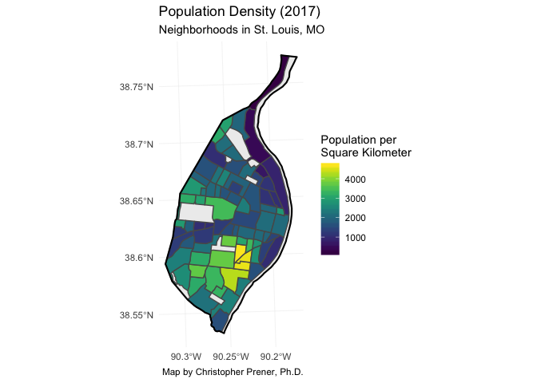<!-- -->

To save our map, we again use the `ggsave()`
function:

``` r
ggsave(here("examples", "results", "ggplot2_popDensity17_2.png"), ggplot_17_5, dpi = 500)
```

    ## Saving 7 x 5 in image

### Clean-up Enviornment Again

We’ll get rid of the `ggplot2` objects we’ve created:

``` r
rm(ggplot_17_1, ggplot_17_2, ggplot_17_3, ggplot_17_4, ggplot_17_5)
```

## Map Layouts with `tmap`

`tmap` uses a similar logic to `ggplot2` - it layers elements on top of
each other to produce maps. It is dedicated to working with spatial
data, however, and has some features that `ggplot2` does not.

### Basic Mapping of Geometric Objects

We’ll start with a basic map that, like we have previously, just display
the geometry of the city’s neighborhoods. Similar to `ggplot2`,
functions are chainted together with the `+` sign. We can read these
like paragraphs:

1.  First, we take the `nhoods` data, **then**
2.  we create our `tmap` layer out of its shape, **then**
3.  we add a fill using our layer, **then**
4.  we add borders using our layer.

<!-- end list -->

``` r
nhoods %>%
  tm_shape() +
    tm_fill() +
    tm_borders() 
```

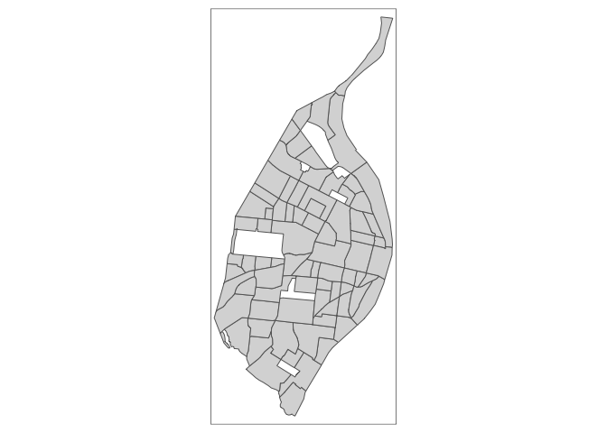<!-- -->

### Mapping Quantities with `tmap`

Like `ggplot2`, we can plot quantities using the `tm_polygons()`
function. The `palette` argument accepts names of both `RColorBrewer`
and `viridis` palettes.

``` r
nhoods %>%
  tm_shape() +
    tm_polygons(col = "pop17", palette = "Greens")
```

    ## Some legend labels were too wide. These labels have been resized to 0.47, 0.44, 0.44. Increase legend.width (argument of tm_layout) to make the legend wider and therefore the labels larger.

<!-- -->

Notice that this is a map of population counts, and is therefore not
normalized. `tamp` makes the normalization process easy, with the
`convert2density` argument:

``` r
nhoods %>%
  tm_shape() +
    tm_polygons(col = "pop17", palette = "Reds", convert2density = TRUE)
```

    ## Some legend labels were too wide. These labels have been resized to 0.51, 0.51, 0.51, 0.51. Increase legend.width (argument of tm_layout) to make the legend wider and therefore the labels larger.

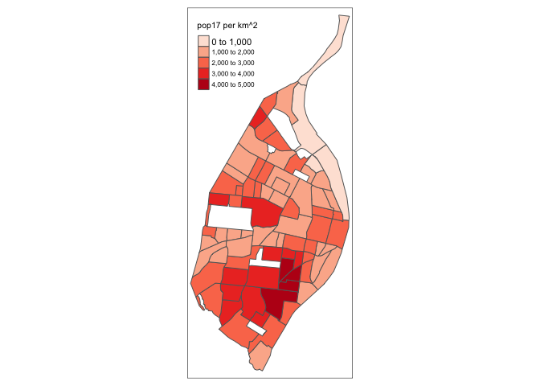<!-- -->

We can shrink (or grow) the number of classes using the `n` argument in
`tm_polygons`, though I’ve found it to be unreliable occasionally:

``` r
nhoods %>%
  tm_shape() +
    tm_polygons(col = "pop17", 
                palette = "BuPu", 
                n = 3,
                convert2density = TRUE)
```

    ## Some legend labels were too wide. These labels have been resized to 0.51, 0.51. Increase legend.width (argument of tm_layout) to make the legend wider and therefore the labels larger.

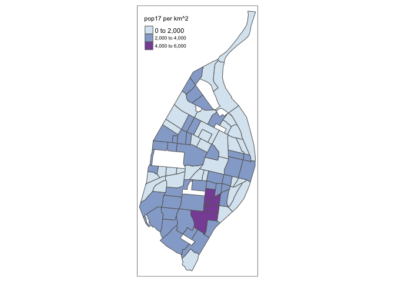<!-- -->

We can also change the breaks are calculated. `tmap` uses the `"pretty"`
approach by default, whereas ArcGIS uses the `"jenks"` approach. We can
mirror ArcGIS by specifying `"jenks"`, and can continue to adjust the
number of breaks:

``` r
nhoods %>%
  tm_shape() +
    tm_polygons(col = "pop17", 
                palette = "BuPu", 
                style = "jenks",
                n = 6,
                convert2density = TRUE)
```

    ## Legend labels were too wide. The labels have been resized to 0.59, 0.51, 0.51, 0.51, 0.51, 0.51. Increase legend.width (argument of tm_layout) to make the legend wider and therefore the labels larger.

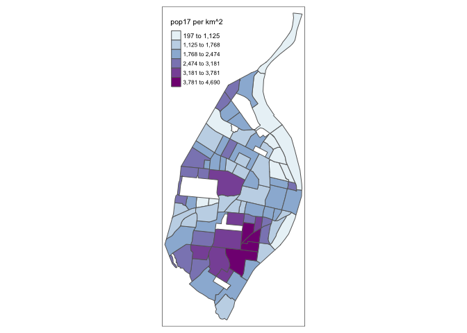<!-- -->

Another option is to use the `"equal"` approach to breaks, which divides
our observations into equally sized classes:

``` r
nhoods %>%
  tm_shape() +
    tm_polygons(col = "pop17", 
                palette = "BuPu", 
                style = "equal",
                n = 6,
                convert2density = TRUE)
```

    ## Some legend labels were too wide. These labels have been resized to 0.59, 0.51, 0.51, 0.51, 0.51. Increase legend.width (argument of tm_layout) to make the legend wider and therefore the labels larger.

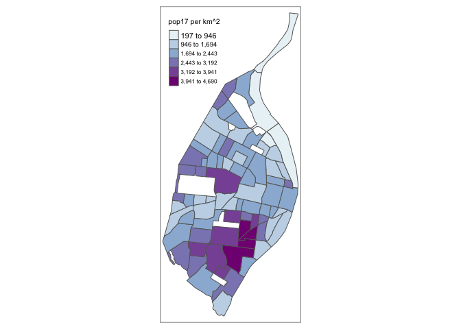<!-- -->

### Creating Map Layouts with `tmap`

Once we have a map we like, we can begin to build a layout around it.
Like with our `ggplot2` map layout, we’ll add the city underneath by
adding a shape below `nhoods`. We’ll use the `city` data for this. We’ll
add the `city` on top as well to achieve that outline effect we
discussed with `ggplot2` as well:

``` r
tm_shape(city) +
  tm_fill(fill = "ebebeb") + 
  tm_shape(nhoods) +
  tm_polygons(col = "pop17", 
              palette = "viridis", 
              style = "jenks",
              convert2density = TRUE) +
  tm_shape(city) +
  tm_borders(lwd = 2)
```

    ## Legend labels were too wide. The labels have been resized to 0.64, 0.56, 0.56, 0.56, 0.56. Increase legend.width (argument of tm_layout) to make the legend wider and therefore the labels larger.

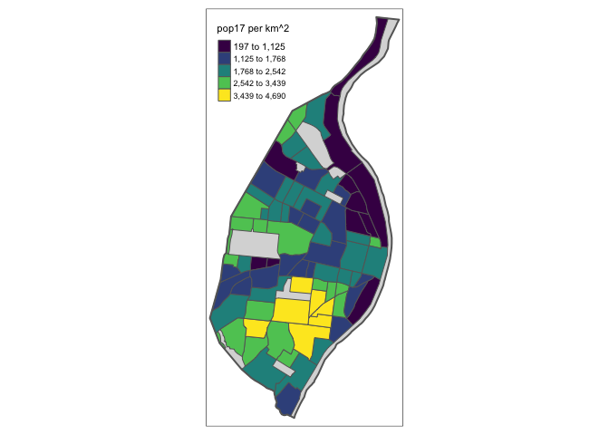<!-- -->

Notice how we have to add each layer using `tm_shape()` before beginning
to modify its astheic properties.

We can also add adornments to our map layouts, including a scale bar
(with `tm_scale_bar()`):

``` r
tm_shape(city) +
  tm_fill(fill = "ebebeb") + 
  tm_shape(nhoods) +
  tm_polygons(col = "pop17", 
              palette = "viridis", 
              style = "jenks",
              convert2density = TRUE) +
  tm_shape(city) +
  tm_borders(lwd = 2) +
  tm_scale_bar() 
```

    ## Legend labels were too wide. The labels have been resized to 0.64, 0.56, 0.56, 0.56, 0.56. Increase legend.width (argument of tm_layout) to make the legend wider and therefore the labels larger.

<!-- -->

Once we have a layout that we like, we can use `tm_layout()` to add a
title and move the legend if necessary.

``` r
# create tmap object
tm_shape(city) +
  tm_fill(fill = "ebebeb") + 
  tm_shape(nhoods) +
  tm_polygons(col = "pop17", 
              palette = "viridis", 
              style = "jenks",
              convert2density = TRUE,
              title = "Population per\nSquare Kilomer") +
  tm_shape(city) +
  tm_borders(lwd = 2) +
  tm_scale_bar() +
  tm_layout(
    title = "Population Density (2017)",
    frame = FALSE,
    legend.outside = TRUE,
    legend.position = c("left", "bottom")) -> tmap_17_1

# print object
tmap_17_1
```

<!-- -->

`tmap` lacks the ability to add subtitles and captions to plot layouts,
which is a drawback. Once we have our object created, we can save it
using `tmap_save()`, which is functionally the same as
`ggplot2::ggsave()` but with slightly different
arguments:

``` r
tmap_save(tm = tmap_17_1, filename = here("examples", "results", "tamp_popDensity17_1.png"), dpi = 500)
```

    ## Map saved to /Users/chris/GitHub/SOC5650/LectureRepos/lecture-05/examples/results/tamp_popDensity17_1.png

    ## Resolution: 3500 by 2500 pixels

    ## Size: 7 by 5 inches (500 dpi)

### Adding Histograms

One neat feature that `tmap` has is the ability to add a histogram of
the mapped variable to the legend as well. This is done by adding
`legend.hist = TRUE` to the `tm_polygons()` function:

``` r
# create tmap object
tm_shape(city) +
  tm_fill(fill = "ebebeb") + 
  tm_shape(nhoods) +
  tm_polygons(col = "pop17", 
              palette = "GnBu", 
              style = "jenks",
              convert2density = TRUE,
              title = "Population per\nSquare Kilomer",
              legend.hist = TRUE) +
  tm_shape(city) +
  tm_borders(lwd = 2) +
  tm_scale_bar() +
  tm_layout(
    title = "Population Density (2017)",
    frame = FALSE,
    legend.outside = TRUE,
    legend.position = c("left", "bottom")) -> tmap_17_2

# print object
tmap_17_2
```

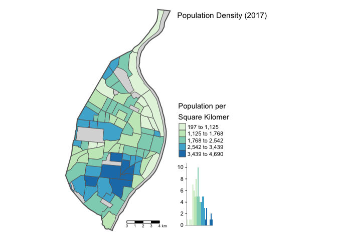<!-- -->

Once again, we can save this using
`tmap_save()`:

``` r
tmap_save(tm = tmap_17_2, filename = here("examples", "results", "tamp_popDensity17_2.png"), dpi = 500)
```

    ## Map saved to /Users/chris/GitHub/SOC5650/LectureRepos/lecture-05/examples/results/tamp_popDensity17_2.png

    ## Resolution: 3500 by 2500 pixels

    ## Size: 7 by 5 inches (500 dpi)
