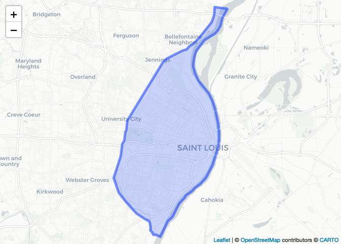
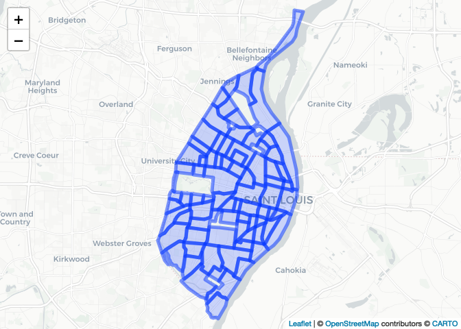
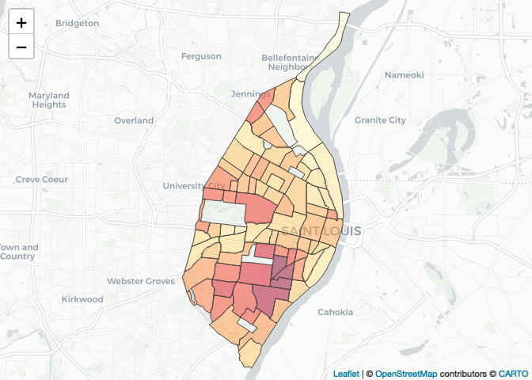
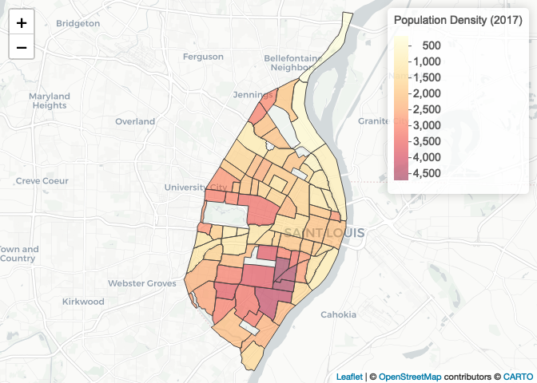
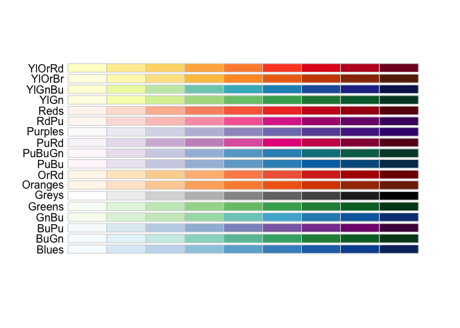
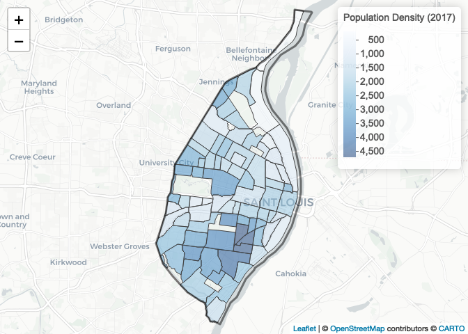
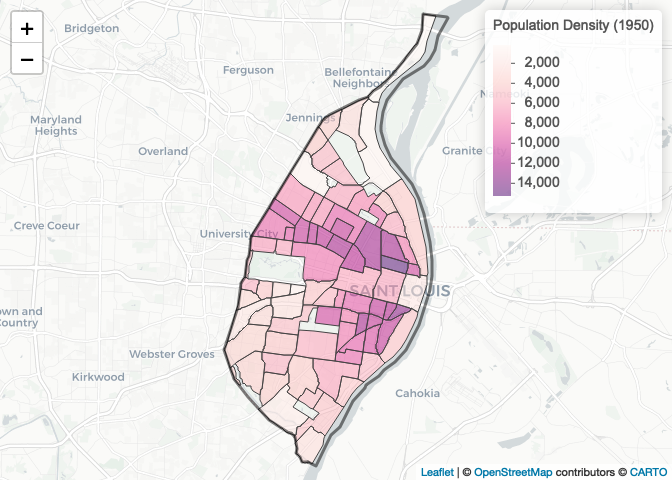

Meeting Examples - Complete
================
Christopher Prener, Ph.D.
(May 03, 2021)

## Introduction

This notebook covers interactive map production in `R` using the
`leflet` library. We’ll review some of what we discussed during [the
first course meeting](https://slu-soc5650.github.io/docs/meeting_01/)
and then introduce some additional complexity with `leaflet`.

## Dependencies

This notebook requires a variety of packages for working with spatial
data:

``` r
# tidyverse packages
library(dplyr)        # data wrangling
```

    ## 
    ## Attaching package: 'dplyr'

    ## The following objects are masked from 'package:stats':
    ## 
    ##     filter, lag

    ## The following objects are masked from 'package:base':
    ## 
    ##     intersect, setdiff, setequal, union

``` r
# spatial packages
library(leaflet)      # interactive maps
library(mapview)      # preview spatial data
```

    ## GDAL version >= 3.1.0 | setting mapviewOptions(fgb = TRUE)

``` r
library(sf)           # spatial data tools
```

    ## Linking to GEOS 3.8.1, GDAL 3.1.4, PROJ 6.3.1

``` r
# other packages
library(here)         # file path management
```

    ## here() starts at /Users/chris/GitHub/slu-soc5650/content/module-5-leaflet

``` r
library(measurements) # convert units
library(RColorBrewer) # color palettes
```

## Load Data

This notebook requires the data stored in `data/example-data/`. We’ll
automatically convert these to WGS84 for mapping, since this is the
coordinate system they require:

``` r
city <- st_read(here("data", "example-data", "STL_BOUNDARY_City", "STL_BOUNDARY_City.shp"), stringsAsFactors = FALSE) %>%
  st_transform(crs = 4326)
```

    ## Reading layer `STL_BOUNDARY_City' from data source `/Users/chris/GitHub/slu-soc5650/content/module-5-leaflet/data/example-data/STL_BOUNDARY_City/STL_BOUNDARY_City.shp' using driver `ESRI Shapefile'
    ## Simple feature collection with 1 feature and 17 fields
    ## Geometry type: POLYGON
    ## Dimension:     XY
    ## Bounding box:  xmin: -90.32052 ymin: 38.53185 xmax: -90.16657 ymax: 38.77443
    ## Geodetic CRS:  GRS 1980(IUGG, 1980)

``` r
nhoods <- st_read(here("data", "example-data", "STL_DEMOS_Nhoods", "STL_DEMOS_Nhoods.shp"), stringsAsFactors = FALSE) %>%
  st_transform(crs = 4326)
```

    ## Reading layer `STL_DEMOS_Nhoods' from data source `/Users/chris/GitHub/slu-soc5650/content/module-5-leaflet/data/example-data/STL_DEMOS_Nhoods/STL_DEMOS_Nhoods.shp' using driver `ESRI Shapefile'
    ## Simple feature collection with 79 features and 6 fields
    ## Geometry type: MULTIPOLYGON
    ## Dimension:     XY
    ## Bounding box:  xmin: 733361.8 ymin: 4268512 xmax: 745417.9 ymax: 4295501
    ## Projected CRS: UTM_Zone_15_Northern_Hemisphere

## Interactive Mapping with `leaflet` (Module 1 review)

### Basic Mapping of Geometric Objects

During our first course meeting, we discussed the creation of
interactive maps using the `leaflet` package.
[Leaflet](https://leafletjs.com) is a JavaScript library for creating
interactive maps. It is primarily focused on web and mobile mapping. The
`leaflet` package for `R` provides access to the JavaScript library.

Leaflet provides a number of basemaps for mapping. If you add map tiles
using `addTiles()`, you’ll get the open street map basemap. Other
basemaps can be added using `addProviderTiles()`. The names of available
options can be found using:

``` r
names(providers)
```

    ##   [1] "OpenStreetMap"                      
    ##   [2] "OpenStreetMap.Mapnik"               
    ##   [3] "OpenStreetMap.DE"                   
    ##   [4] "OpenStreetMap.CH"                   
    ##   [5] "OpenStreetMap.France"               
    ##   [6] "OpenStreetMap.HOT"                  
    ##   [7] "OpenStreetMap.BZH"                  
    ##   [8] "OpenSeaMap"                         
    ##   [9] "OpenPtMap"                          
    ##  [10] "OpenTopoMap"                        
    ##  [11] "OpenRailwayMap"                     
    ##  [12] "OpenFireMap"                        
    ##  [13] "SafeCast"                           
    ##  [14] "Thunderforest"                      
    ##  [15] "Thunderforest.OpenCycleMap"         
    ##  [16] "Thunderforest.Transport"            
    ##  [17] "Thunderforest.TransportDark"        
    ##  [18] "Thunderforest.SpinalMap"            
    ##  [19] "Thunderforest.Landscape"            
    ##  [20] "Thunderforest.Outdoors"             
    ##  [21] "Thunderforest.Pioneer"              
    ##  [22] "Thunderforest.MobileAtlas"          
    ##  [23] "Thunderforest.Neighbourhood"        
    ##  [24] "OpenMapSurfer"                      
    ##  [25] "OpenMapSurfer.Roads"                
    ##  [26] "OpenMapSurfer.Hybrid"               
    ##  [27] "OpenMapSurfer.AdminBounds"          
    ##  [28] "OpenMapSurfer.ContourLines"         
    ##  [29] "OpenMapSurfer.Hillshade"            
    ##  [30] "OpenMapSurfer.ElementsAtRisk"       
    ##  [31] "Hydda"                              
    ##  [32] "Hydda.Full"                         
    ##  [33] "Hydda.Base"                         
    ##  [34] "Hydda.RoadsAndLabels"               
    ##  [35] "MapBox"                             
    ##  [36] "Stamen"                             
    ##  [37] "Stamen.Toner"                       
    ##  [38] "Stamen.TonerBackground"             
    ##  [39] "Stamen.TonerHybrid"                 
    ##  [40] "Stamen.TonerLines"                  
    ##  [41] "Stamen.TonerLabels"                 
    ##  [42] "Stamen.TonerLite"                   
    ##  [43] "Stamen.Watercolor"                  
    ##  [44] "Stamen.Terrain"                     
    ##  [45] "Stamen.TerrainBackground"           
    ##  [46] "Stamen.TerrainLabels"               
    ##  [47] "Stamen.TopOSMRelief"                
    ##  [48] "Stamen.TopOSMFeatures"              
    ##  [49] "TomTom"                             
    ##  [50] "TomTom.Basic"                       
    ##  [51] "TomTom.Hybrid"                      
    ##  [52] "TomTom.Labels"                      
    ##  [53] "Esri"                               
    ##  [54] "Esri.WorldStreetMap"                
    ##  [55] "Esri.DeLorme"                       
    ##  [56] "Esri.WorldTopoMap"                  
    ##  [57] "Esri.WorldImagery"                  
    ##  [58] "Esri.WorldTerrain"                  
    ##  [59] "Esri.WorldShadedRelief"             
    ##  [60] "Esri.WorldPhysical"                 
    ##  [61] "Esri.OceanBasemap"                  
    ##  [62] "Esri.NatGeoWorldMap"                
    ##  [63] "Esri.WorldGrayCanvas"               
    ##  [64] "OpenWeatherMap"                     
    ##  [65] "OpenWeatherMap.Clouds"              
    ##  [66] "OpenWeatherMap.CloudsClassic"       
    ##  [67] "OpenWeatherMap.Precipitation"       
    ##  [68] "OpenWeatherMap.PrecipitationClassic"
    ##  [69] "OpenWeatherMap.Rain"                
    ##  [70] "OpenWeatherMap.RainClassic"         
    ##  [71] "OpenWeatherMap.Pressure"            
    ##  [72] "OpenWeatherMap.PressureContour"     
    ##  [73] "OpenWeatherMap.Wind"                
    ##  [74] "OpenWeatherMap.Temperature"         
    ##  [75] "OpenWeatherMap.Snow"                
    ##  [76] "HERE"                               
    ##  [77] "HERE.normalDay"                     
    ##  [78] "HERE.normalDayCustom"               
    ##  [79] "HERE.normalDayGrey"                 
    ##  [80] "HERE.normalDayMobile"               
    ##  [81] "HERE.normalDayGreyMobile"           
    ##  [82] "HERE.normalDayTransit"              
    ##  [83] "HERE.normalDayTransitMobile"        
    ##  [84] "HERE.normalDayTraffic"              
    ##  [85] "HERE.normalNight"                   
    ##  [86] "HERE.normalNightMobile"             
    ##  [87] "HERE.normalNightGrey"               
    ##  [88] "HERE.normalNightGreyMobile"         
    ##  [89] "HERE.normalNightTransit"            
    ##  [90] "HERE.normalNightTransitMobile"      
    ##  [91] "HERE.reducedDay"                    
    ##  [92] "HERE.reducedNight"                  
    ##  [93] "HERE.basicMap"                      
    ##  [94] "HERE.mapLabels"                     
    ##  [95] "HERE.trafficFlow"                   
    ##  [96] "HERE.carnavDayGrey"                 
    ##  [97] "HERE.hybridDay"                     
    ##  [98] "HERE.hybridDayMobile"               
    ##  [99] "HERE.hybridDayTransit"              
    ## [100] "HERE.hybridDayGrey"                 
    ## [101] "HERE.hybridDayTraffic"              
    ## [102] "HERE.pedestrianDay"                 
    ## [103] "HERE.pedestrianNight"               
    ## [104] "HERE.satelliteDay"                  
    ## [105] "HERE.terrainDay"                    
    ## [106] "HERE.terrainDayMobile"              
    ## [107] "FreeMapSK"                          
    ## [108] "MtbMap"                             
    ## [109] "CartoDB"                            
    ## [110] "CartoDB.Positron"                   
    ## [111] "CartoDB.PositronNoLabels"           
    ## [112] "CartoDB.PositronOnlyLabels"         
    ## [113] "CartoDB.DarkMatter"                 
    ## [114] "CartoDB.DarkMatterNoLabels"         
    ## [115] "CartoDB.DarkMatterOnlyLabels"       
    ## [116] "CartoDB.Voyager"                    
    ## [117] "CartoDB.VoyagerNoLabels"            
    ## [118] "CartoDB.VoyagerOnlyLabels"          
    ## [119] "CartoDB.VoyagerLabelsUnder"         
    ## [120] "HikeBike"                           
    ## [121] "HikeBike.HikeBike"                  
    ## [122] "HikeBike.HillShading"               
    ## [123] "BasemapAT"                          
    ## [124] "BasemapAT.basemap"                  
    ## [125] "BasemapAT.grau"                     
    ## [126] "BasemapAT.overlay"                  
    ## [127] "BasemapAT.highdpi"                  
    ## [128] "BasemapAT.orthofoto"                
    ## [129] "nlmaps"                             
    ## [130] "nlmaps.standaard"                   
    ## [131] "nlmaps.pastel"                      
    ## [132] "nlmaps.grijs"                       
    ## [133] "nlmaps.luchtfoto"                   
    ## [134] "NASAGIBS"                           
    ## [135] "NASAGIBS.ModisTerraTrueColorCR"     
    ## [136] "NASAGIBS.ModisTerraBands367CR"      
    ## [137] "NASAGIBS.ViirsEarthAtNight2012"     
    ## [138] "NASAGIBS.ModisTerraLSTDay"          
    ## [139] "NASAGIBS.ModisTerraSnowCover"       
    ## [140] "NASAGIBS.ModisTerraAOD"             
    ## [141] "NASAGIBS.ModisTerraChlorophyll"     
    ## [142] "NLS"                                
    ## [143] "JusticeMap"                         
    ## [144] "JusticeMap.income"                  
    ## [145] "JusticeMap.americanIndian"          
    ## [146] "JusticeMap.asian"                   
    ## [147] "JusticeMap.black"                   
    ## [148] "JusticeMap.hispanic"                
    ## [149] "JusticeMap.multi"                   
    ## [150] "JusticeMap.nonWhite"                
    ## [151] "JusticeMap.white"                   
    ## [152] "JusticeMap.plurality"               
    ## [153] "Wikimedia"                          
    ## [154] "GeoportailFrance"                   
    ## [155] "GeoportailFrance.parcels"           
    ## [156] "GeoportailFrance.ignMaps"           
    ## [157] "GeoportailFrance.maps"              
    ## [158] "GeoportailFrance.orthos"            
    ## [159] "OneMapSG"                           
    ## [160] "OneMapSG.Default"                   
    ## [161] "OneMapSG.Night"                     
    ## [162] "OneMapSG.Original"                  
    ## [163] "OneMapSG.Grey"                      
    ## [164] "OneMapSG.LandLot"

As you can see, there are a ton of choices! We’ll use `CartoDB.Positron`
here, but feel free to pick one that you like for assignments if we
don’t specify what you should use. Make sure that your other
cartographic selections, such as color, do not clash with your basemap.

The basic `leaflet` workflow involves piping functions together (the
`%>%` operator). Each time to see the pipe, think of the word “then.”
For example, the following code chunk would read:

1.Take the `city` object, **then** 2. use it as the basis for creating a
`leaflet` object with `leaflet()`, **then** 3. add a basemap using the
`CartoDB.Positron` tiles, **then** 4. add polygons and create a pop-up.

``` r
city %>%
  leaflet() %>%
  addProviderTiles(providers$CartoDB.Positron) %>%
  addPolygons(popup = ~NAME)
```

<!-- -->

### Adding Pop-ups

We can get more into the weeds with the neighborhood data since they
have additional features. We can create more detailed pop-ups using the
`base::paste()` function and some html tags. The most important html
tags to know are:

-   `<b>text</b>` - bold text
-   `<em>text</em>` - italicized text
-   `<br>` - line break

``` r
nhoods %>%  
  leaflet() %>%
  addProviderTiles(providers$CartoDB.Positron) %>%
  addPolygons(popup = paste("<b>Name:</b> ", nhoods$NHD_NAME, "<br>",
                            "<b>2017 Population:</b> ", round(nhoods$pop17, digits = 0)))
```

<!-- -->

### Mapping Quantities with `leaflet`

If we want to turn this into a thematic choropleth map, we can add some
additional parameters to the `addPolygons()` function. Before we do
that, however, we should create normalized versions of our two
population variables, `pop50` and `pop17`. We can use the `AREA` column,
which represents the area of each neighborhood in square meters, as a
basis for this.

``` r
nhoods %>%
  mutate(sq_km = conv_unit(AREA, from = "m2", to = "km2"), .after = "AREA") %>%
  mutate(pop50_den = pop50/sq_km, .after = "pop50") %>%
  mutate(pop17_den = pop17/sq_km, .after = "pop17") -> nhoods
```

Now that we have these normalized, we can get mapping! The additional
cartographic options we’ll mention are:

-   `color` - outline (“stroke”) color for each polygon
-   `weight` - stroke width
-   `opacity` - stroke opacity
-   `smoothFactor` - allows `leaflet` to simplify polygons depending on
    zoom
-   `fillOpacity` - fill opacity
-   `fillColor` - creates the fill itself
-   `highlightOptions` - creates effect when mouse drags over specific
    polygons

What I have here are good default settings for most of these options,
but feel free to experiment!

When we created our pop-up, we want to round our values so that we don’t
see the very long real number associated with our data. By using
`base::round(var, digits = 0)`, we round to the nearest integer.
`digits = 2` would give us two decimal places in contrast.

``` r
# create color palette
npal <- colorNumeric("YlOrRd", nhoods$pop17_den)

# create leaflet object
nhoods %>%
  leaflet() %>%
  addProviderTiles(providers$CartoDB.Positron) %>%
  addPolygons(
    color = "#444444", 
    weight = 1, 
    opacity = 1.0, 
    smoothFactor = 0.5,
    fillOpacity = 0.5,
    fillColor = ~npal(pop17_den),
    highlightOptions = highlightOptions(color = "white", weight = 2, bringToFront = TRUE),
    popup = paste("<b>Name:</b> ", nhoods$NHD_NAME, "<br>",
                  "<b>2017 Population:</b> ", round(nhoods$pop17, digits = 0), "<br>",
                  "<b>2017 Population per Square Kilometer:</b> ", round(nhoods$pop17_den, digits = 2))) 
```

<!-- -->

Next, we should add a legend to make the map easier to interpret. This
is done with the `addLegend()` argument. The `opacity` argument in
`addLegend()` should match the `fillOpacity` argument in
`addPolygons()`!

``` r
# create color palette
npal <- colorNumeric("YlOrRd", nhoods$pop17_den)

# create leaflet object
nhoods %>%
  leaflet() %>%
  addProviderTiles(providers$CartoDB.Positron) %>%
  addPolygons(
    color = "#444444", 
    weight = 1, 
    opacity = 1.0, 
    smoothFactor = 0.5,
    fillOpacity = 0.5,
    fillColor = ~npal(pop17_den),
    highlightOptions = highlightOptions(color = "white", weight = 2, bringToFront = TRUE),
    popup = paste("<b>Name:</b> ", nhoods$NHD_NAME, "<br>",
                  "<b>2017 Population:</b> ", round(nhoods$pop17, digits = 0), "<br>",
                  "<b>2017 Population per Square Kilometer:</b> ", round(nhoods$pop17_den, digits = 2))) %>%
    addLegend(pal = npal, values = ~pop17_den, opacity = .5, title = "Population Density (2017)")
```

<!-- -->

As a review, the color palette we’re using comes from the `RColorBrewer`
package. We can use `RColorBrewer::display.brewer.all()` to identify
other color ramps:

``` r
display.brewer.all(type = "seq")
```

<!-- -->

One final complication we’ll discuss is adding the city’s outline on top
of the `addPolygons()` function. We can’t use a second instance of
`addPolygons()` in our call, and so we’ll use the `addPolylines()`
function instead. This allows us to display the boundary as a line
instead of a polygon feature.

``` r
# create color palette
npal <- colorNumeric("Blues", nhoods$pop17_den)

# create leaflet object
nhoods %>%
  leaflet() %>%
  addProviderTiles(providers$CartoDB.Positron) %>%
  addPolygons(
    color = "#444444", 
    weight = 1, 
    opacity = 1.0, 
    smoothFactor = 0.5,
    fillOpacity = 0.5,
    fillColor = ~npal(pop17_den),
    highlightOptions = highlightOptions(color = "white", weight = 2, bringToFront = TRUE),
    popup = paste("<b>Name:</b> ", nhoods$NHD_NAME, "<br>",
                  "<b>2017 Population:</b> ", round(nhoods$pop17, digits = 0), "<br>",
                  "<b>2017 Population per Square Kilometer:</b> ", round(nhoods$pop17_den, digits = 2))) %>%
    addPolylines(
      data = city,
      color = "#000000",
      weight = 3
    ) %>%
    addLegend(pal = npal, values = ~pop17_den, opacity = .5, title = "Population Density (2017)")
```

<!-- -->

For our final `leaflet` map, write your own code to map the 1950
population density of neighborhoods:

``` r
# create color palette
npal <- colorNumeric("RdPu", nhoods$pop50_den)

# create map
nhoods %>%
  leaflet() %>%
  addProviderTiles(providers$CartoDB.Positron) %>%
  addPolygons(
    color = "#444444", 
    weight = 1, 
    smoothFactor = 0.5,
    opacity = 1.0, 
    fillOpacity = 0.5,
    fillColor = ~npal(pop50_den),
    highlightOptions = highlightOptions(color = "white", weight = 2, bringToFront = TRUE),
    popup = paste("<b>Name:</b> ", nhoods$NHD_NAME, "<br>",
                  "<b>1950 Population:</b> ", round(nhoods$pop50, digits = 0), "<br>",
                  "<b>1950 Population per Square Kilometer:</b> ", 
                      round(nhoods$pop50_den, digits = 2))) %>%
    addPolylines(
      data = city,
      color = "#000000",
      weight = 3
    ) %>%
    addLegend(pal = npal, values = ~pop50_den, opacity = .5, 
              title = "Population Density (1950)")
```

<!-- -->
